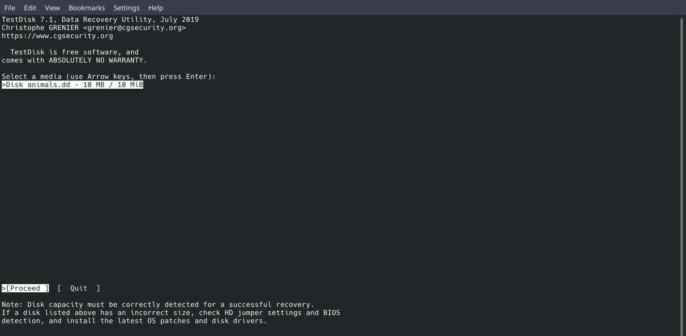
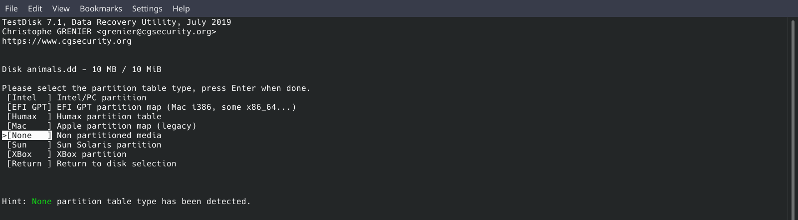
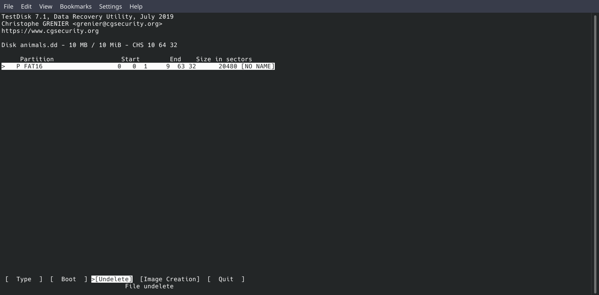
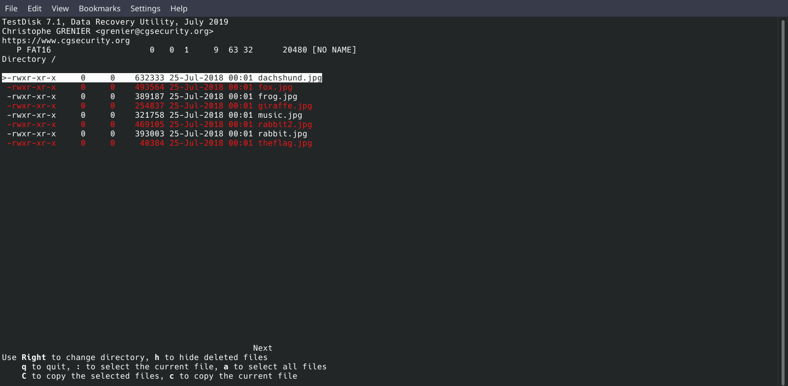

# OSC linux Meeting - Forensics III - DISK IMAGING.
##### Session Moderator: [Martina Gerges](https://github.com/MartinaGerges).

## What is Disk Imaging?
it is a bit by bit exact copy of the hard drive / device

## Why do we need Disk Imaging?
disk images are used for different reasons like backup or disk recovery sometimes

## Disk Imaging Types.
1. **imaging** : 
it is a bit by bit exact copy of the device to an image (file) located anywhere as long as there is enough space. that enables one disk to carry more than one image unlike cloning
2. **cloning** : 
it is a bit by bit exact copy of the device A to another device B, so you can't clone more than 1 device to the same device

## How to make a disk image?

we will take a look at dd and dcfldd both of them are used in imaging and cloning depends on the input and output.

* Imaging
if = device , of = image/file
    ```bash
      dd if=/dev/sd? of=~/image.dd
      dcfldd if=/dev/sd? of=~/image.dd
    ```

* Cloning
if = device , of = device
    ```bash
     dd if=/dev/sd? of=/dev/sd?
     dcfldd if=/dev/sd? of=/dev/sd?
     ```

    from here we can see that dcfldd and dd are almost identical so what is the difference?
    dcfldd is an enhanced dd for digital forensics and it features:
    * Hashing on-the-fly: it hash the input data as it is being transferred, helping to ensure data integrity.
    * Image verify: it can verify that a target drive is a bit-for-bit match of the specified input file or pattern.
    and other features that can be found in the man page

    ```bash
    dcfldd if=/dev/sd? of=~/image.dd hash=md5,sha1,sha256
    dcfldd if=/dev/sd? vf=~/image.dd
    ```

## scaning Disk image
another part of the disk image which is usually found in CTFs challenges is scanning/investigating a particular image and retriving the flag from it

well HOW ?

using testdisk tool we will try to solve Recovering From the Snap pico ctf 2018
okay let's see that dd file
```bash
sudo testdisk animals.dd
```


as we are just retriving info not fixing something we would go with the detected



we would choose the advanced



it seems like nothing is found yet so maybe it was deleted so let's try undelete



indeed it was deleted now retrieve the picture to see the flag

and FINALLYY here it is


