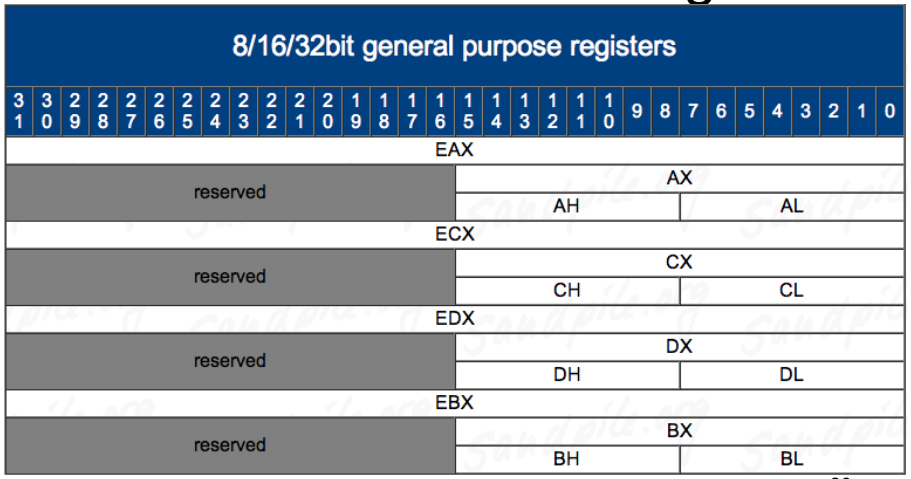
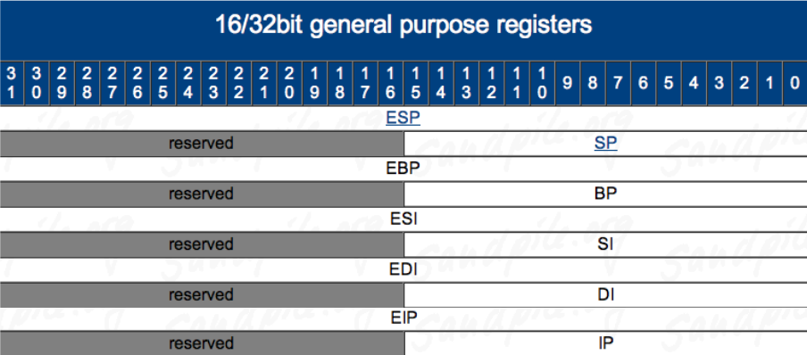

# Intro to Intel x86 - Lecture 1

We will learn that
```c
int main(){
    printf("Hello World\n");
    return 0x1234;
}
```

is the same as

```asm
.text:00401000 main            
.text:00401000       push    offset aHelloWorld ; "Hello world\n"
.text:00401005       call    ds:__imp__printf
.text:0040100B       pop     ecx
.text:0040100C       mov     eax, 1234h
.text:00401011       retn
```
---
## Refreshers

Remember Data Types In C?

### char - Byte
| 7   | 0    |
| --- | ---- |
|     | Byte |

### short - Word
| 15        | 8   | 7        | 0   |
| --------- | --- | -------- | --- |
| High Byte |     | Low Byte |

### int/long - Doubleword
| 31        | 16  | 15       | 0   |
| --------- | --- | -------- | --- |
| High Word |     | Low Word |

### double/long long - Quadword
| 63              | 32  | 31             | 0   |
| --------------- | --- | -------------- | --- |
| High Doubleword |     | Low Doubleword |

### long double
| 127           | 64  | 63           | 0   |
| ------------- | --- | ------------ | --- |
| High Quadword |     | Low Quadword |


| Decimal (base 10) | Binary (base 2) | Hex (base 16) |
| ----------------- | --------------- | ------------- |
| 00                | 0000b           | 0x00          |
| 01                | 0001b           | 0x01          |
| 02                | 0010b           | 0x02          |
| 03                | 0011b           | 0x03          |
| 04                | 0100b           | 0x04          |
| 05                | 0101b           | 0x05          |
| 06                | 0110b           | 0x06          |
| 07                | 0111b           | 0x07          |
| 08                | 1000b           | 0x08          |
| 09                | 1001b           | 0x09          |
| 10                | 1010b           | 0x0A          |
| 11                | 1011b           | 0x0B          |
| 12                | 1100b           | 0x0C          |
| 13                | 1101b           | 0x0D          |
| 14                | 1110b           | 0x0E          |
| 15                | 1111b           | 0x0F          |

---

## Architecture

Intel is CISC - Complex Instruction Set Computer

Other architectures like ARM, SPARC, MIPS

## Architecture - Endian

- Endianness comes from Jonathan Swift's Gulliver's Travels. It doesn't matter which way you eat your eggs :)

- Little Endian - 0x12345678 stored in RAM “little end”first. The least significant byte of a word or larger is stored in the lowest address. E.g. 0x78563412 
  - Intel is Little Endian

- Big Endian - 0x12345678 stored as is. 
  - Network traffic is Big Endian 
  - Most everyone else you've heard of (PowerPC, ARM, SPARC, MIPS) is either Big Endian by default or can be configured as either (Bi-Endian)

## Architecture - Registers

Registers are small memory storage areas built into the processor (still volatile memory)

8 “general purpose” registers + the instruction pointer which points at the next instruction to execute

- On x86-32, registers are 32 bits long 
- On x86-64, they're 64 bits 

### Register Convention

- EAX - Stores function return values

- ECX - Counter for string and loop operations

- ESI - Source pointer for string operations

- EDI - Destination pointer for string

- ESP - Stack pointer

- EBP - Stack frame base pointer

- EIP - Pointer to next instruction to excute

Caller save registers :
- eax
- edx
- ecx

The Caller is the function that calls another function

If the caller has anything in the registers that it cares about, the caller is in charge of saving the value before a call to a subroutine, and restoring the value after the call returns

Callee save registers:
- ebp
- ebx
- esi
- edi 

The Callee is the called function

If the callee needs to use more registers than are saved by the caller, the callee is responsible for making sure the values are stored/restored

## Architecture - Registers - 8/16/32 bit addressing





## Architecture - EFLAGS

EFlags holds many single bit (true - false) flags

- Zero Flag (ZF) - Set to 1 if the Result of some instrucion is zero
- Sign Flag (SF) - Set equal to the sign bit of a signed integer (0 is positive, 1 is negative)

## The Stack

- The Stack is a conceptual area of RAM which is designed by the OS when a program is started
- The Stack is Last-In-First-Out data structure
- By convention the stack grows toward lower memory addresses - the top of stack is the lowest in memory
- ESP points to the top of the stack
- The Stack is used to keep track of which functions were called before the current one, it holds local variables and is frequently used to pass arguments to the next function to be called.

## Calling Convention

- cdecl
  - "C declaration" - most common calling convention
  - Function parameters pushed onto stack right to left
  - Saves the old stack frame pointer and sets up a new stack frame 
  - eax or edx:eax returns the result for primitive data types
  - Caller is responsible for cleaning up the stack 
- stdcall
  - used in "Microsoft C++ code"
  - same as cdel but:
    - Callee responsible for cleaning up any stack parameters it takes

## Addressing Forms
In Intel syntax, most of the time square brackets [] means to treat the value within as a memory address, and fetch the value at that address (like dereferencing a pointer)

[base + index*scale + disp]

- mov eax, ebx
- mov eax, [ebx]
- mov eax, [ebx+ecx*X] (X=1, 2, 4, 8)
- mov eax, [ebx+ecx*X+Y] (Y= one byte, 0-255 or 4 bytes, 0-2^32-1)

## Instructions

- NOP - No Operation
  - Can be used to pad/align bytes or to delay time
  - Used to make some exploits more reliable, discussed later
- PUSH - Push Word, Doubleword, Quadword onto the stack
  - the push instruction automatically decrements the stack pointer (esp) by 4
- POP - Pop Value from the stack
  - increaments the esp by 4
-  Call - Call Procedure
    -  CALL's job is to transfer control to a different function, in a way that control can later be resumed where it left off 
    -  First it pushes the address of the next instruction onto the stack
      -  For use by RET for when the procedure is done -
    -  Then it changes eip to the address given in the instruction 
    -  Destination address can be specified in multiple ways
      -  Absolute address
      -  Relative address (relative to the end of the instruction)
- RET - Return from Procedure
  - Two forms
    - Pop the top of the stack into eip (remember pop increments stack pointer)
      - In this form, the instruction is just written as “ret”
      - Typically used by cdecl functions
    - Pop the top of the stack into eip and add  a constant number of bytes to esp
      - In this form, the instruction is written as “ret 0x00"
      - Typically used by stdcall functions
- MOV - Move
    - moves value of:
      - register to register
      - memory to register, register to memory
      - immediate to register, immediate to memory  
- LEA - Load Effective Address
  - Frequently used with pointer arithmetic, sometimes for just arithmetic in general
  - Uses the r/m32 form but is the exception to the rule that the square brackets [ ] syntax means dereference (“value at”)
  - Example: ebx = 0x2, edx = 0x1000
    - lea eax, [edx+ebx*2]
    - eax = 0x1004, not the value at 0x1004
- ADD - Add Value & SUB - Subtract value
  - Destination operand can be r/m32 or register
  - Source operand can be r/m32 or register or immediate
  - No source and destination as r/m32s, because that could allow for memory to memory transfer, which isn't allowed on x86
  - Evaluates the operation as if it were on signed AND unsigned data, and sets flags as appropriate. Instructions modify OF, SF, ZF, AF, PF, and CF flags
  - Example
    - add esp, 8
    - sub eax, [ebx*2]

Back to Hello World

```
.text:00401730  main
.text:00401730    push ebp
.text:00401731    mov ebp, esp
.text:00401733    push offset aHelloWorld ; "Hello world\n“
.text:00401738    call ds:__imp__printf
.text:0040173E    add esp, 4
.text:00401741    mov eax, 1234h
.text:00401746    pop ebp
.text:00401747    retn
```